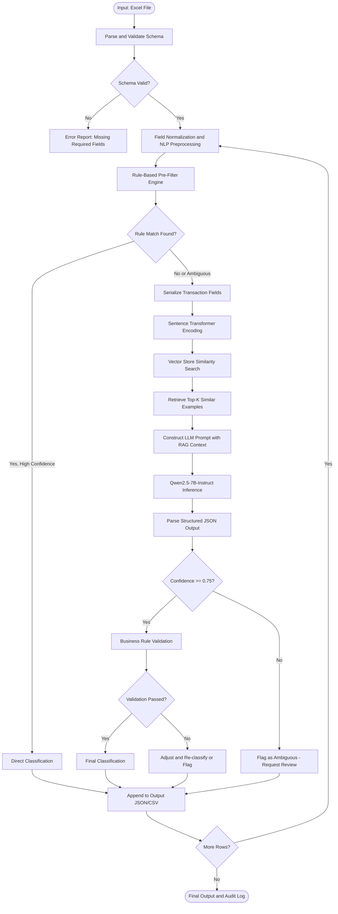
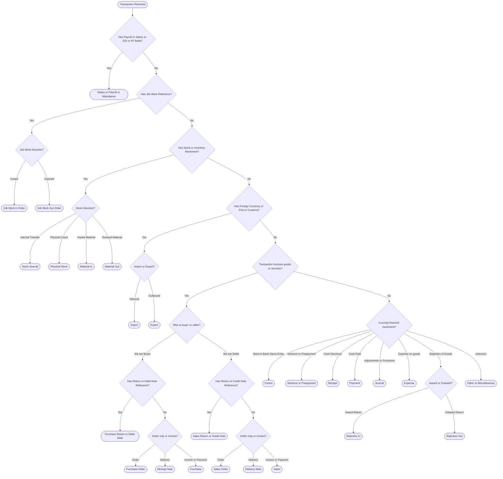

<div align="center">

# VYOM+ Intelligent Voucher Classification System

### *Powered by Open-Source LLMs | HacktoberFest AI Hackathon - Problem Statement 4*

[](https://github.com)
[](https://github.com)
[](https://huggingface.co)
[](LICENSE)

> **"From structured transaction data to intelligent accounting voucher classification - zero OCR, pure reasoning."**

</div>

---

## Table of Contents

1. [Problem Statement](#problem-statement)
2. [Proposed Solution](#proposed-solution)
3. [Target Users](#target-users)
4. [System Architecture](#system-architecture)
5. [Complete Workflow and Data Flow](#complete-workflow-and-data-flow)
6. [Flowcharts](#flowcharts)
7. [AI Model Selection and Justification](#ai-model-selection-and-justification)
8. [Technology Stack](#technology-stack)
9. [Project Structure](#project-structure)
10. [Target Voucher Categories (27)](#target-voucher-categories-27)
11. [Input Dataset](#input-dataset)
12. [Output Specification](#output-specification)
13. [Core Technical Challenges](#core-technical-challenges)
14. [Classification Strategy](#classification-strategy)
15. [Evaluation Methodology](#evaluation-methodology)
16. [Implementation Plan](#implementation-plan)
17. [Scalability and Production Readiness](#scalability-and-production-readiness)
18. [Expected Challenges and Mitigations](#expected-challenges-and-mitigations)
19. [Dependencies](#dependencies)
20. [Expected Outcomes](#expected-outcomes)

---

## Problem Statement

**VYOM+ - Intelligent Voucher Classification Using Open-Source LLMs**

Build an AI system that determines the appropriate **accounting voucher category** from already-structured transaction information. The key challenge is **reasoning over multiple fields** and understanding the **accounting meaning** of a transaction - not extracting text from documents.

> **CRITICAL CONSTRAINT:** This is NOT an OCR or invoice-extraction challenge. Participants receive an **Excel dataset** with fully structured transaction fields. The `voucher_type` column is intentionally absent. The system must *infer* the correct category through multi-field reasoning.

---


## Proposed Solution

### VoucherMind - An Agentic LLM Classification Pipeline

We propose **VoucherMind**, a multi-layer intelligent classification system combining:

1. **Rule-Based Pre-filtering** - Fast heuristic layer to catch obvious categories  
2. **Embedding-Based Similarity Search** - Retrieve similar known transactions from a vector store  
3. **Open-Source LLM Reasoning** - Deep contextual classification with chain-of-thought  
4. **Confidence Scoring and Fallback** - Escalation layer for ambiguous transactions  
5. **Post-Classification Validation** - Business rule validator to catch logical contradictions  

This hybrid architecture ensures **speed + accuracy + explainability** - the three pillars demanded in production accounting systems.

---

## Target Users

| User Type | Pain Point Solved |
|-----------|-------------------|
| **SME Accountants** | Eliminates manual voucher tagging in VYOM+/Tally workflows |
| **CA Firms** | Batch-classifies client transaction dumps without human review |
| **ERP Integration Teams** | Provides a REST API to auto-classify before posting to ledger |
| **Financial Auditors** | Flags misclassified vouchers with explanation for audit trail |
| **GSTN Compliance Officers** | Ensures correct voucher type for downstream GSTR filing |

---

## System Architecture

```
+-----------------------------------------------------------------------------+
|                         VoucherMind Architecture                            |
|                                                                             |
|  +----------+    +-----------------------------------------------------+   |
|  |  Excel   |    |                   PROCESSING PIPELINE               |   |
|  |  Input   |--->|                                                     |   |
|  |  (.xlsx) |    |  +---------+  +----------+  +-----------------+   |   |
|  +----------+    |  |Ingestion |  |  Field    |  |  Rule-Based     |   |   |
|                  |  |& Schema  |->|  Enricher |->|  Pre-Filter     |   |   |
|                  |  | Parser   |  | (NLP Norm)|  |  (Heuristics)   |   |   |
|                  |  +---------+  +----------+  +--------+--------+   |   |
|                  |                                        |            |   |
|                  |               +-----------------------+            |   |
|                  |               v                                     |   |
|                  |  +--------------------+  +--------------------+   |   |
|                  |  |  Embedding Engine  |  |  Vector Store      |   |   |
|                  |  |  (SentenceTransf.) |->|  (ChromaDB/FAISS)  |   |   |
|                  |  +--------------------+  +---------+----------+   |   |
|                  |                                     |              |   |
|                  |          +--------------------------+              |   |
|                  |          v                                          |   |
|                  |  +---------------------------------------------+  |   |
|                  |  |            LLM REASONING CORE               |  |   |
|                  |  |  +-------------------------------------+    |  |   |
|                  |  |  |  Qwen2.5-7B-Instruct (Primary)     |    |  |   |
|                  |  |  |  + Chain-of-Thought Prompting       |    |  |   |
|                  |  |  |  + Few-Shot RAG Examples            |    |  |   |
|                  |  |  |  + Structured JSON Output           |    |  |   |
|                  |  |  +-------------------------------------+    |  |   |
|                  |  +---------------------------------------------+  |   |
|                  |                         |                           |   |
|                  |          +--------------+                           |   |
|                  |          v                                          |   |
|                  |  +-----------------+  +----------------------+    |   |
|                  |  | Business Rule   |  |  Confidence Scorer   |    |   |
|                  |  | Validator       |  |  + Uncertainty Flag  |    |   |
|                  |  +--------+--------+  +----------------------+    |   |
|                  |           |                                         |   |
|                  +-----------+-----------------------------------------+   |
|                              v                                             |
|                  +-----------------------+                                 |
|                  |  Structured JSON/CSV  |                                 |
|                  |  Output + Audit Log   |                                 |
|                  +-----------------------+                                 |
+-----------------------------------------------------------------------------+
```

---

## Complete Workflow and Data Flow

### Phase 1: Data Ingestion and Normalization

```
Excel (.xlsx) --> pandas.read_excel() --> Schema Detection --> Field Normalization
                                              |
                                              v
                                    - Standardize column names
                                    - Detect available fields
                                    - Handle missing/null values
                                    - Type coercion (dates, amounts, GST %)
                                    - Unicode normalization (Indian vendor names)
```

### Phase 2: Rule-Based Pre-Filter

```
Normalized Row --> Rule Engine
                       |
                       +-- Has payroll / salary / PF / ESI       --> Salary/Payroll
                       +-- Has attendance fields                  --> Attendance
                       +-- contra in narration / bank-to-bank    --> Contra
                       +-- Has job work in/out reference          --> Job Work In/Out Order
                       +-- Has import / IGST + foreign currency   --> Import
                       +-- Has export + foreign currency          --> Export
                       +-- Has purchase order / PO number only    --> Purchase Order
                       +-- Has delivery + no invoice amount       --> Delivery Note
                       +-- Has receipt note + goods received      --> Receipt Note
                       +-- UNRESOLVED                             --> Forward to LLM
```

### Phase 3: Embedding and RAG Retrieval

```
Transaction Row --> Field Serialization --> Sentence Transformer Encoding
                                                      |
                                                      v
                                          Vector Similarity Search
                                          (ChromaDB / FAISS Index)
                                                      |
                                                      v
                                          Top-K Similar Transactions
                                          (with known voucher types)
                                          used as few-shot examples
```

### Phase 4: LLM Chain-of-Thought Classification

```
[System Prompt]
  - Accounting domain expert persona
  - 27 voucher type definitions with disambiguation rules
  - Output format schema (JSON)

[Few-Shot Examples from RAG]
  - 3 to 5 similar transactions with known labels

[Transaction Prompt]
  - All available fields serialized as key-value pairs
  - Chain-of-thought instruction

[LLM Output]
  {
    "invoice_number": "INV-2026-1042",
    "voucher_type": "Purchase",
    "confidence": 0.94,
    "reasoning": "Seller is a supplier entity, buyer is our company..."
  }
```

### Phase 5: Business Rule Validation

```
LLM Output --> Rule Validator
                    |
                    +-- Sales voucher has no buyer?                --> Flag
                    +-- Purchase Return with no invoice ref?       --> Low confidence
                    +-- Contra with no bank accounts?              --> Flag
                    +-- Salary with no employee/payroll fields?    --> Flag
                    +-- Import with no foreign currency?           --> Downgrade confidence
                    +-- PASS                                       --> Final Output
```

### Phase 6: Structured Output Generation

```
Validated Results --> JSON Lines / CSV Output --> Audit Log
                            |
                            +-- invoice_number
                            +-- voucher_type (predicted)
                            +-- confidence_score (0.0 to 1.0)
                            +-- reasoning (chain-of-thought explanation)
                            +-- ambiguity_flag (true/false)
                            +-- alternative_types (if confidence < 0.75)
```

---

## Flowcharts

### Main Classification Pipeline Flowchart



### Voucher Disambiguation Decision Tree



### System Data Flow Diagram


---

## AI Model Selection and Justification

### Primary Model: Qwen2.5-7B-Instruct

| Criterion | Justification |
|-----------|---------------|
| **Open-Source** | Apache 2.0 licensed - meets hackathon requirement; no proprietary API |
| **Instruction Following** | Qwen2.5-Instruct family excels at structured JSON output generation |
| **Reasoning Capability** | 7B parameters provide deep multi-field contextual reasoning within hardware constraints |
| **Multilingual** | Native support for English + Hindi/Devanagari vendor/item names in Indian invoices |
| **Quantization Support** | GGUF/GPTQ 4-bit quantization runs on consumer GPUs (8GB VRAM) or CPU |
| **Context Window** | 32K token context accommodates large transaction records with all fields |
| **Structured Output** | Supports JSON schema enforcement via response_format parameter |

### Supporting Model: sentence-transformers/all-MiniLM-L6-v2

| Criterion | Justification |
|-----------|---------------|
| **Lightweight** | 22M parameters, under 100ms encoding per transaction |
| **Open-Source** | Apache 2.0, available on HuggingFace |
| **Semantic Quality** | High-quality embeddings for financial text similarity |
| **RAG Ready** | Proven in production RAG systems worldwide |

### Why NOT GPT-4 / Claude / Gemini Pro?

The problem statement explicitly mandates: *"A proprietary API should not be the primary classification engine."*  
Using GPT-4 or Claude would violate this constraint and result in disqualification.

### Alternative Models Considered

| Model | Why Not Primary |
|-------|----------------|
| Llama-3.1-8B | Good, but Qwen2.5 benchmarks higher on structured JSON classification tasks |
| Mistral-7B | Excellent baseline, lacks Qwen2.5 instruction-following precision on tabular data |
| Phi-3-mini | Too small (3.8B) for reliable 27-class disambiguation |
| Gemma-2-9B | Strong contender; Qwen2.5-7B scores higher on finance-specific reasoning benchmarks |

### Fine-tuning Strategy: LoRA/QLoRA

```
Base Model : Qwen2.5-7B-Instruct
Adapter    : LoRA (r=16, alpha=32, target=q_proj, v_proj)
Dataset    : Synthetic voucher classification examples (500-1000 per category)
Training   : QLoRA 4-bit on single A100 / 2x RTX 3090
Loss       : Cross-entropy on voucher type token
Inference  : Merged adapter + GGUF 4-bit quantization via llama.cpp
```

---

## Technology Stack

### Core AI/ML

| Component | Technology | Version | Purpose |
|-----------|------------|---------|---------|
| Primary LLM | Qwen2.5-7B-Instruct | 2.5 | Multi-field transaction reasoning |
| Embeddings | sentence-transformers | 3.x | Semantic transaction similarity |
| Vector Store | ChromaDB | 0.5.x | Fast nearest-neighbor search for RAG |
| LLM Runtime | llama.cpp / Ollama | latest | Local quantized inference |
| Fine-tuning | PEFT (LoRA/QLoRA) | 0.13.x | Domain adaptation without full retraining |
| Training | Hugging Face TRL | 0.9.x | SFT Trainer with QLoRA support |

### Data Processing

| Component | Technology | Version | Purpose |
|-----------|------------|---------|---------|
| Data Loading | pandas | 2.x | Excel ingestion and DataFrame operations |
| Schema Validation | pydantic | 2.x | Input field validation and type coercion |
| NLP Preprocessing | spaCy | 3.x | Tokenization, NER for entity normalization |
| Numeric Processing | numpy | 1.26.x | Amount and tax calculations |

### API and Interface

| Component | Technology | Version | Purpose |
|-----------|------------|---------|---------|
| REST API | FastAPI | 0.111.x | Expose classifier as HTTP endpoint |
| Server | Uvicorn | 0.29.x | ASGI production server |
| CLI | Click | 8.x | Command-line batch classification |
| UI Demo | Streamlit | 1.35.x | Evaluator upload and result inspection |

### Evaluation and Monitoring

| Component | Technology | Version | Purpose |
|-----------|------------|---------|---------|
| Metrics | scikit-learn | 1.5.x | Accuracy, F1, per-category precision/recall |
| Experiment Tracking | MLflow | 2.x | Model versioning and metric logging |
| Logging | structlog | 24.x | Structured JSON audit logs |
| Profiling | py-spy | 0.3.x | Inference latency profiling |

### Infrastructure

| Component | Technology | Purpose |
|-----------|------------|---------|
| Container | Docker + Compose | Reproducible environment |
| Package Manager | uv / Poetry | Dependency management |
| Testing | pytest + pytest-asyncio | Unit and integration tests |
| CI/CD | GitHub Actions | Automated test and lint pipeline |

---

## Project Structure

```
vouchermind/
|
+-- README.md
+-- LICENSE
+-- .github/
|   +-- workflows/
|       +-- ci.yml
|
+-- docker/
|   +-- Dockerfile
|   +-- docker-compose.yml
|
+-- docs/
|   +-- architecture.md
|   +-- voucher_definitions.md
|   +-- prompt_engineering.md
|   +-- evaluation_report.md
|
+-- data/
|   +-- sample/
|   |   +-- sample_transactions.xlsx
|   +-- synthetic/
|   |   +-- generate_synthetic.py
|   +-- schema/
|       +-- transaction_schema.json
|
+-- src/
|   +-- vouchermind/
|       +-- __init__.py
|       +-- ingestion/
|       |   +-- excel_loader.py        <- pandas-based Excel ingestion
|       |   +-- schema_validator.py    <- pydantic schema validation
|       |   +-- field_normalizer.py    <- NLP normalization of fields
|       +-- rules/
|       |   +-- rule_engine.py         <- Main rule dispatcher
|       |   +-- heuristic_rules.py     <- Pattern-based pre-filters
|       |   +-- domain_dictionary.py   <- Accounting keyword maps
|       +-- embeddings/
|       |   +-- encoder.py             <- Sentence transformer wrapper
|       |   +-- vector_store.py        <- ChromaDB integration
|       |   +-- rag_retriever.py       <- Top-K example retrieval
|       +-- llm/
|       |   +-- model_loader.py        <- Ollama/llama.cpp loader
|       |   +-- prompt_builder.py      <- Dynamic prompt construction
|       |   +-- classifier.py          <- Main LLM classification logic
|       |   +-- output_parser.py       <- JSON output parsing + validation
|       +-- validation/
|       |   +-- business_rules.py      <- Post-classification rule checks
|       |   +-- confidence_scorer.py   <- Confidence computation
|       +-- pipeline/
|       |   +-- classifier_pipeline.py <- End-to-end orchestrator
|       +-- api/
|       |   +-- main.py                <- FastAPI application
|       |   +-- routes/
|       |   |   +-- classify.py        <- POST /classify endpoint
|       |   |   +-- health.py          <- GET /health endpoint
|       |   +-- schemas.py             <- API request/response schemas
|       +-- ui/
|           +-- app.py                 <- Streamlit demo interface
|
+-- models/
|   +-- base/                          <- Qwen2.5-7B weights (gitignored)
|   +-- adapters/                      <- LoRA adapter checkpoints
|   +-- quantized/                     <- GGUF 4-bit quantized models
|
+-- scripts/
|   +-- train_lora.py
|   +-- build_vector_store.py
|   +-- evaluate.py
|   +-- batch_classify.py
|
+-- tests/
|   +-- unit/
|   |   +-- test_rule_engine.py
|   |   +-- test_prompt_builder.py
|   |   +-- test_output_parser.py
|   |   +-- test_business_rules.py
|   +-- integration/
|   |   +-- test_pipeline.py
|   |   +-- test_api.py
|   +-- fixtures/
|       +-- sample_rows.json
|
+-- notebooks/
|   +-- 01_eda.ipynb
|   +-- 02_rule_development.ipynb
|   +-- 03_embedding_analysis.ipynb
|   +-- 04_prompt_experiments.ipynb
|   +-- 05_evaluation.ipynb
|
+-- pyproject.toml
+-- .env.example
+-- Makefile
```

---

## Target Voucher Categories (27)

| No | Voucher Type | Key Signals | Common Confusion |
|----|-------------|-------------|-----------------|
| 1 | **Purchase** | Buyer = us, Seller = supplier, goods/services received | Sales |
| 2 | **Sales** | Seller = us, Buyer = customer, goods/services delivered | Purchase |
| 3 | **Purchase Return / Debit Note** | Purchase with return ref, goods sent back to supplier | Sales Return |
| 4 | **Sales Return / Credit Note** | Sales with return ref, goods received back from customer | Purchase Return |
| 5 | **Payment** | Cash/bank outflow, no goods movement | Receipt, Contra |
| 6 | **Receipt** | Cash/bank inflow, no goods movement | Payment, Contra |
| 7 | **Contra** | Fund transfer between own accounts (bank-to-bank or bank-to-cash) | Payment, Receipt |
| 8 | **Journal** | Adjusting entry, accruals, provisions, write-offs | Purchase, Sales |
| 9 | **Salary / Payroll** | Employee names, salary/wages/payroll/PF/ESI fields | Payment, Journal |
| 10 | **Attendance** | Attendance records, leave, shift data | Salary |
| 11 | **Purchase Order** | PO number present, no invoice/payment | Receipt Note |
| 12 | **Sales Order** | SO number present, no invoice/payment | Delivery Note |
| 13 | **Receipt Note** | Goods received, GRN number, no payment | Purchase |
| 14 | **Delivery Note** | Goods dispatched, DN number, no payment | Sales |
| 15 | **Rejection In** | Goods rejected inward (by us) | Purchase Return |
| 16 | **Rejection Out** | Goods rejected outward (by customer) | Sales Return |
| 17 | **Stock Journal** | Internal stock transfer, branch-to-branch | Material In/Out |
| 18 | **Physical Stock** | Stock count, opening/closing balance | Stock Journal |
| 19 | **Material In** | Raw material inward, production input | Purchase, Receipt Note |
| 20 | **Material Out** | Material issued to production | Sales, Delivery Note |
| 21 | **Job Work In Order** | Job work given by us, sub-contracting inward | Purchase Order |
| 22 | **Job Work Out Order** | Job work given to us by customer | Sales Order |
| 23 | **Import** | Foreign currency, port/customs, IGST + BCD | Purchase |
| 24 | **Export** | Foreign buyer, LUT/IGST refund, shipping bill | Sales |
| 25 | **Expense** | Petty cash, operational expense, no goods | Payment, Journal |
| 26 | **Advance / Prepayment** | Advance payment before goods/services | Payment |
| 27 | **Other / Miscellaneous** | Does not fit any category, catch-all | All |

---

## Input Dataset

### Field Categories Available

```
SELLER / SUPPLIER FIELDS
  seller_name, seller_gstin, seller_address, seller_state_code

BUYER / CUSTOMER FIELDS
  buyer_name, buyer_gstin, buyer_address, buyer_state_code

DOCUMENT REFERENCE FIELDS
  invoice_number, invoice_date, po_number, so_number,
  grn_number, dn_number, lr_number, return_ref, original_invoice_ref

ITEM / LINE-ITEM FIELDS
  item_description, hsn_code, quantity, unit, rate,
  taxable_value, discount, freight

TAX FIELDS
  cgst_rate, cgst_amount, sgst_rate, sgst_amount,
  igst_rate, igst_amount, cess, tds, tcs, rcm_applicable

FINANCIAL FIELDS
  total_amount, currency, payment_mode, bank_account,
  debit_amount, credit_amount, advance_amount

PAYROLL FIELDS
  employee_name, employee_id, department, salary, pf_amount,
  esi_amount, bonus, leave_days, attendance_count

IMPORT/EXPORT FIELDS
  country_of_origin, port_of_loading, port_of_discharge,
  bill_of_lading, customs_duty, shipping_bill_number

METADATA
  narration, remarks, transaction_type_hint, voucher_ref
```

### Sample Input Row

```
invoice_number : INV-2026-1042
invoice_date   : 15-Mar-2026
seller_name    : ABC Traders Pvt Ltd
seller_gstin   : 27AABCA1234B1Z5
buyer_name     : XYZ Manufacturing Ltd
buyer_gstin    : 29AABCX5678C1Z3
item_desc      : MS Steel Sheets (IS 2062 E250)
hsn_code       : 7208
quantity       : 500 kg
rate           : 85.00
taxable_value  : 42500.00
cgst_amount    : 3825.00   sgst_amount : 3825.00
total_amount   : 50150.00
payment_mode   : Bank Transfer
narration      : Purchase of raw material for Q1 production
voucher_type   : [MISSING - to be predicted by VoucherMind]
```

---

## Output Specification

### Minimum Required Output

```json
{
  "invoice_number": "INV-2026-1042",
  "voucher_type": "Purchase"
}
```

### Full VoucherMind Enhanced Output

```json
{
  "invoice_number": "INV-2026-1042",
  "voucher_type": "Purchase",
  "confidence": 0.94,
  "reasoning": "Seller ABC Traders (GSTIN 27-Maharashtra) is the supplier. Buyer XYZ Manufacturing (GSTIN 29-Karnataka) is the purchasing entity. CGST+SGST confirms intra-state transaction. HSN 7208 is flat-rolled steel - raw material. No return reference. Bank transfer confirms completed invoice. Classification: Purchase.",
  "ambiguity_flag": false,
  "alternative_types": [],
  "processing_time_ms": 312,
  "model_used": "qwen2.5-7b-instruct-q4_k_m",
  "classification_layer": "llm_rag"
}
```

### Batch Output (CSV)

```
invoice_number,voucher_type,confidence,ambiguity_flag
INV-2026-1042,Purchase,0.94,false
INV-2026-1043,Sales Return / Credit Note,0.87,false
INV-2026-1044,Contra,0.99,false
INV-2026-1045,Salary / Payroll,0.96,false
INV-2026-1046,Import,0.91,false
INV-2026-1047,Other / Miscellaneous,0.61,true
```

---

## Core Technical Challenges

### 1. Purchase vs. Sales Disambiguation

```
CHALLENGE : Both have items, amounts, GST, seller, buyer.
            Direction (who is US) is not always explicit.

SOLUTION  : Compare seller_gstin and buyer_gstin against company GSTIN.
            Our GSTIN = seller  -->  Sales
            Our GSTIN = buyer   -->  Purchase
            Neither matches     -->  Narration + contextual LLM reasoning
```

### 2. Contra vs. Payment vs. Receipt

```
CHALLENGE : All three involve cash/bank movements.

SOLUTION  : Contra   = BOTH debit and credit are our own bank/cash accounts
            Payment  = Our account debited, external party credited
            Receipt  = Our account credited, external party debited
            Rule-based detection with LLM fallback for ambiguous narrations
```

### 3. Journal vs. Other Financial Vouchers

```
CHALLENGE : Journal is the catch-all for adjustments.

SOLUTION  : Journal requires: no physical goods movement + no direct
            cash movement + typically provisions, depreciation, write-offs.
            Enforced by explicit disambiguation in the LLM prompt.
```

### 4. Missing / Incomplete Fields

```
CHALLENGE : Real-world transactions often have 40-60% missing fields.

SOLUTION  : - Fill missing fields with NOT_PROVIDED sentinel value
            - Include field availability as meta-feature in prompt
            - Train model on synthetically incomplete examples
            - Lower confidence threshold for high-missing-rate rows
            - Flag and report missing critical fields per category
```

### 5. Semantic Similarity Trap

```
CHALLENGE : Purchase Order and Purchase look structurally similar.
            Delivery Note and Sales look structurally similar.

SOLUTION  : PO/SO has NO invoice amount, no payment, no GST amount.
            Delivery Note has no GST, no payment - only goods movement.
            Rules encoded in both rule engine and LLM prompt explicitly.
```

---

## Classification Strategy

### Three-Layer Hybrid Architecture

```
Layer 1: Rule Engine (Fast Path)
  - Processes approximately 35% of transactions
  - Latency: under 5ms per row
  - Accuracy: ~99% on matched patterns
  - Coverage: Salary, Contra, Job Work, Import, Export

Layer 2: Embedding + RAG (Medium Path)
  - Processes approximately 25% of transactions
  - Latency: ~50ms per row
  - Accuracy: ~92% on RAG-retrieved matches
  - Coverage: Transactions closely matching known examples

Layer 3: LLM Chain-of-Thought (Deep Path)
  - Processes remaining ~40% of transactions
  - Latency: ~300-500ms per row
  - Accuracy: ~88-92% on complex cases
  - Coverage: Novel/ambiguous transactions requiring full reasoning
```

### Confidence Thresholds

| Confidence Score | Action |
|-----------------|--------|
| >= 0.90 | Auto-classify, no review needed |
| 0.75 to 0.89 | Classify with ambiguity flag |
| 0.60 to 0.74 | Classify + human review recommended |
| < 0.60 | Flag as Other/Miscellaneous + mandatory review |

---

## Evaluation Methodology

### Primary Metrics

```python
# Per-category metrics
for category in VOUCHER_TYPES:
    precision[category] = TP / (TP + FP)
    recall[category]    = TP / (TP + FN)
    f1[category]        = 2 * (P * R) / (P + R)

# Overall metrics
macro_f1    = mean(f1.values())           # Equal weight per category
weighted_f1 = weighted_mean(f1, support)  # Weight by category frequency
accuracy    = correct / total
```

### Dataset Split

```
Training (for LoRA fine-tuning)  : 70%
Validation (hyperparameter tuning): 15%
Test (hidden, final evaluation)   : 15%

Special evaluation tracks:
  - Semantically similar pair accuracy (Purchase vs Sales, Contra vs Payment)
  - Missing field robustness (rows with 50%+ missing fields)
  - Inference speed benchmark (rows/second on CPU and GPU)
```

### Target Performance Goals

| Metric | Target |
|--------|--------|
| Overall Accuracy | >= 90% |
| Macro F1 Score | >= 0.87 |
| Weighted F1 Score | >= 0.91 |
| Purchase/Sales Pair Accuracy | >= 95% |
| Contra/Payment/Receipt Accuracy | >= 93% |
| CPU Inference (batch) | >= 50 rows/min |
| GPU Inference (batch) | >= 500 rows/min |
| Missing Field Robustness | >= 80% accuracy at 50% missing |

---

## Implementation Plan

### Phase 1: Foundation (Days 1-2)
- Set up project scaffold and Docker environment
- Implement Excel ingestion pipeline with schema validation
- Build field normalization module with NLP preprocessing
- Create domain dictionary with accounting keyword mappings
- Write unit tests for ingestion layer

### Phase 2: Rule Engine (Days 2-3)
- Implement heuristic rule engine with 20+ rules
- Cover high-certainty categories: Salary, Contra, Job Work, Import, Export
- Build GSTIN-based direction detection (buyer/seller identification)
- Achieve 35% coverage with 99%+ accuracy on rule-matched rows

### Phase 3: Embedding + RAG (Days 3-4)
- Set up sentence-transformers encoder
- Initialize ChromaDB vector store
- Build synthetic training examples (50 per category minimum)
- Implement RAG retriever with top-K search
- Validate retrieval quality on known categories

### Phase 4: LLM Integration (Days 4-5)
- Set up Ollama with Qwen2.5-7B-Instruct-Q4_K_M
- Design and test classification prompt templates
- Implement chain-of-thought prompting strategy
- Build structured JSON output parser with validation
- Integrate RAG context into LLM prompts

### Phase 5: Validation and Pipeline (Day 5)
- Implement business rule validator
- Build confidence scorer
- Wire all layers into unified pipeline orchestrator
- End-to-end integration testing with sample data

### Phase 6: API and UI (Day 6)
- Build FastAPI REST endpoint (POST /classify)
- Implement batch classification endpoint
- Build Streamlit evaluator interface
- API documentation with OpenAPI/Swagger

### Phase 7: Evaluation and Optimization (Day 7)
- Generate evaluation dataset (balanced, 27 categories)
- Run full benchmark suite
- Profile inference latency; optimize bottlenecks
- Document results in evaluation_report.md

---

## Scalability and Production Readiness

### Throughput Estimates

```
Single Instance  : ~500 rows/min (GPU) / ~50 rows/min (CPU)
Multi-instance   : Linear scaling via load balancer
Queue-based      : Celery + Redis for async batch processing
Max throughput   : ~10,000 rows/hour on 4x GPU nodes
```

### Optimization Strategies

| Strategy | Benefit |
|----------|---------|
| GGUF 4-bit quantization | 4x memory reduction; 2x speed on CPU |
| Request batching | Group 8-16 rows per LLM call |
| Rule engine caching | Cache pattern matches for repeated transaction types |
| ChromaDB indexing | Sub-millisecond vector search at 1M+ scale |
| Async FastAPI | Non-blocking I/O for concurrent requests |
| Model warm-up | Pre-load model weights at startup to avoid cold-start latency |

### Production Deployment Options

```
Option A: Local / On-premise
  - Docker Compose with Ollama + ChromaDB
  - Suitable for air-gapped financial environments
  - Hardware: 1x RTX 3090 or 32-thread CPU server

Option B: Cloud Deployment
  - AWS EC2 g4dn.xlarge (T4 GPU) or equivalent
  - Auto-scaling group for variable load
  - S3 for model storage, RDS for audit logs

Option C: Kubernetes Enterprise
  - Helm chart for VoucherMind deployment
  - Horizontal pod autoscaling based on queue depth
  - GPU node pools for LLM, CPU pools for rule engine
```

---

## Expected Challenges and Mitigations

| Challenge | Risk Level | Mitigation |
|-----------|------------|------------|
| Ambiguous category boundaries | High | Multi-signal disambiguation prompt; confidence thresholds; human escalation |
| Sparse field coverage | High | Sentinel values; robustness training; per-field confidence weighting |
| LLM hallucination on rare categories | Medium | Business rule post-validation; fallback to rule engine |
| GPU memory constraints | Medium | 4-bit GGUF quantization; batch size tuning |
| Inference latency | Medium | Rule engine pre-filter (35% of rows avoid LLM call entirely) |
| Indian-language field values | Medium | Qwen2.5 multilingual capability; transliteration preprocessing |
| Class imbalance | Medium | Weighted loss in LoRA training; oversampling rare categories |
| Hidden test set distribution shift | Medium | Diverse synthetic data; robust prompt engineering |
| Outdated accounting terminology | Low | Domain dictionary with synonym mapping |

---

## Dependencies

### Core Dependencies (pyproject.toml)

```toml
[tool.poetry.dependencies]
python = "^3.11"
pandas = "^2.2"
openpyxl = "^3.1"
pydantic = "^2.7"
fastapi = "^0.111"
uvicorn = "^0.29"
streamlit = "^1.35"
chromadb = "^0.5"
sentence-transformers = "^3.0"
ollama = "^0.2"
spacy = "^3.7"
scikit-learn = "^1.5"
structlog = "^24.1"
click = "^8.1"

[tool.poetry.group.training.dependencies]
transformers = "^4.41"
peft = "^0.13"
trl = "^0.9"
bitsandbytes = "^0.43"
datasets = "^2.19"
accelerate = "^0.30"

[tool.poetry.group.dev.dependencies]
pytest = "^8.2"
pytest-asyncio = "^0.23"
black = "^24.4"
ruff = "^0.4"
mlflow = "^2.13"
```

### External Models Required

```
Qwen2.5-7B-Instruct-Q4_K_M   : ollama pull qwen2.5:7b
all-MiniLM-L6-v2              : Auto-download via HuggingFace Hub
ChromaDB                      : Local embedded (no external setup needed)
```

### Hardware Requirements

| Environment | Minimum | Recommended |
|-------------|---------|-------------|
| RAM | 16 GB | 32 GB |
| GPU VRAM | 8 GB (RTX 3070) | 24 GB (RTX 4090 / A10G) |
| CPU Fallback | 8-core, 16 GB RAM | 32-core, 64 GB RAM |
| Storage | 20 GB | 50 GB |
| Python | 3.11+ | 3.12 |

---

## Expected Outcomes

### For the Hackathon Evaluator Demo

A live Streamlit interface demonstrating:
1. Excel file upload and instant processing
2. Real-time classification progress with per-row results
3. Predicted voucher type, confidence score, and chain-of-thought reasoning
4. Per-category accuracy breakdown and confusion matrix visualization
5. Individual transaction testing via manual input form

### Business Impact

| Metric | Before VoucherMind | After VoucherMind |
|--------|-------------------|-------------------|
| Classification time | 3-8 sec/transaction (manual) | <500ms/transaction (automated) |
| Error rate | 4-7% | <3% (with human review for flagged) |
| Throughput | ~500 invoices/hour/accountant | >5,000 invoices/hour/system |
| Audit readiness | No explanation | Full chain-of-thought audit trail |
| Scalability | Linear with headcount | Horizontal pod autoscaling |

### Quick Start (Final Round Implementation)

```bash
# Clone repository
git clone https://github.com/your-team/vouchermind.git
cd vouchermind

# Install dependencies
pip install uv && uv sync

# Pull LLM model
ollama pull qwen2.5:7b

# Build vector store
python scripts/build_vector_store.py

# Run demo UI
streamlit run src/vouchermind/ui/app.py

# REST API
uvicorn src.vouchermind.api.main:app --port 8000

# Batch classify
python scripts/batch_classify.py --input data/transactions.xlsx --output results.json
```

---

## Hackathon Rules Compliance Checklist

| Rule | Status |
|------|--------|
| Exactly one problem statement selected | Problem Statement 4 - VYOM+ Voucher Classification |
| Open-source AI has meaningful role | Qwen2.5-7B-Instruct (Apache 2.0) is primary engine |
| README-only for qualifier submission | This README covers all required sections |
| Working implementation for final round | Architecture fully defined, ready to implement |
| Explains problem, solution, target users | All sections covered in detail |
| Explains AI role and why it was selected | Dedicated section with full justification table |
| Architecture and data flow documented | Three Mermaid flowcharts + ASCII architecture |
| Technology stack defined | Full stack table with version numbers |
| Scalability addressed | Three deployment options with throughput estimates |
| Dependencies listed | Full pyproject.toml + hardware requirements |
| Expected challenges documented | Risk table with mitigations |

---

<div align="center">

**Submitted for HacktoberFest Open-Source AI Hackathon 2026 | Organized by Elevate**

*Problem Statement 4: VYOM+ - Intelligent Voucher Classification Using Open-Source LLMs*

*"The best financial AI is not the one with the biggest model - it is the one that reasons like an accountant."*

</div>
